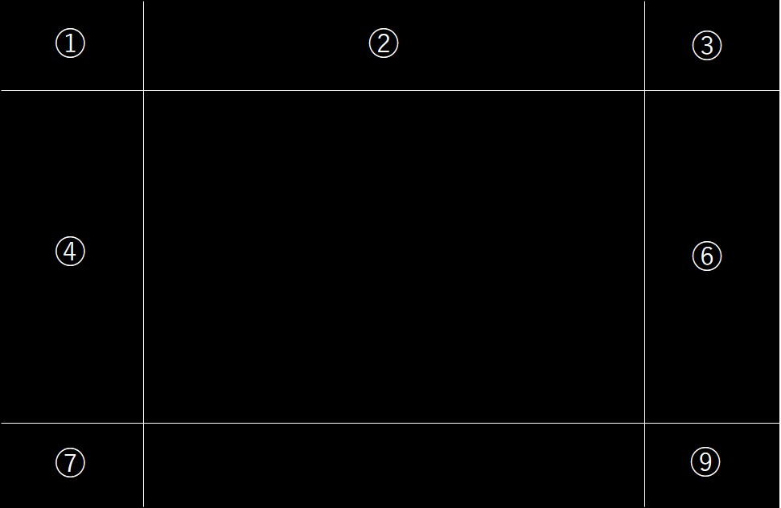

# IVWPF 0.1.9.0 ドキュメント

## 概要
- IVWPF(Image View On WPFは)、画像を表示させる**だけ**のプログラムです。
- 見開きモード（漫画モード）に対応しています。
- 対応画像形式は、JPEG、PNG、GIF、BMP、TIFF、ICON、アニメーションGIF、Ugoira形式（ZIP+JSON)です。
- 操作画面をできるだけ~~サボる~~簡略化しています。
- ファイラを独自に実装しているため、~~MicrosoftのゴミなタブレットUIを使わずに~~タブレットでの利用が可能です。

## 操作方法(ビューアモード)
### キーボード
- ← 次のファイルに移動します
- SPACE 次のファイルに移動します
- → 前のファイルに移動します
- ↑ 次のフォルダに移動します
- ↓ 前のフォルダに移動します
- ESC ファイラーモードに切り替えます
- HOME フォルダ内の最初の画像ファイルに移動します
- END  フォルダ内の最後の画像ファイルに移動します
- 1(キーボード) 1画面モードに切り替えます
- 2(キーボード) 漫画モードに切り替えます

### マウス・タップ

- マウスのホイール 前/次のファイルに移動します
- 右スワイプ(タップだけ) 前のファイルに移動します
- 左スワイプ(タップだけ) 次のファイルに移動します
- 二本指での操作（ピンチなど）
ファイルの拡大・縮小・移動が出来ます
- 左クリック／一本指タップ

 ①　漫画モードを終了します 
 ③　漫画モードに切り替えます 
 ②　ファイラーに移動します 
 ④　次の画面に移動します 
 ⑥  前の画面に移動します 
 ⑦  次のフォルダに移動します 
 ⑨  前のフォルダに移動します 

## 操作方法(ファイラーモード)
ファイラーモードで、表示したいファイルを選択するとその画像が表示されます。デフォルトはマイピクチャフォルダになります。

### キーボード
- ESC ビューアモードに戻ります
- HOME 最初のファイルに移動します
- End 最後のファイルに移動します
- PageUP 10ファイル前のファイルに移動します
- PageDown 10ファイル後のファイルに移動します
- ↑ 1つ前のファイルに移動します
- ↓ 1つ後のファイルに移動します
- ENTER ファイルを決定します。

### マウス／タップ
　標準動作に準拠します。

## 機知のバグ
- 見開きモードで、次のフォルダに移動したとき最初の1つを飛ばす事がある
- フォルダを上に戻ったときに前のフォルダを指さずじ位置がクリアされてしまう事がある。
- コマンドラインやエクスプローラーからの呼び出しには対応してません(ビルドの都合です)